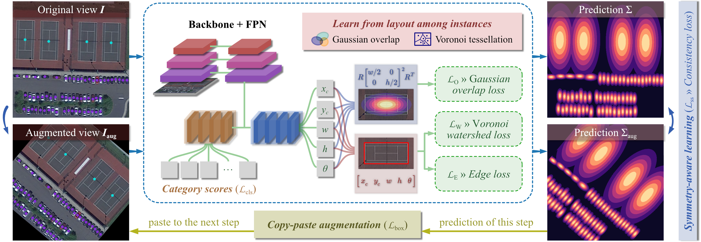

# Point2RBox-v2

> [Point2RBox-v2: Rethinking Point-supervised Oriented Object Detection with Spatial Layout Among Instances](https://arxiv.org/pdf/2502.04268)

<!-- [ALGORITHM] -->

## Abstract

<div align=center>

</div>

With the rapidly increasing demand for oriented object detection (OOD), recent research involving weakly-supervised detectors for learning OOD from point annotations has gained great attention. In this paper, we rethink this challenging task setting with the layout among instances and present Point2RBox-v2. At the core are three principles: 1) Gaussian overlap loss. It learns an upper bound for each instance by treating objects as 2D Gaussian distributions and minimizing their overlap. 2) Voronoi watershed loss. It learns a lower bound for each instance through watershed on Voronoi tessellation. 3) Consistency loss. It learns the size/rotation variation between two output sets with respect to an input image and its augmented view. Supplemented by a few devised techniques, e.g. edge loss and copy-paste, the detector is further enhanced. To our best knowledge, Point2RBox-v2 is the first approach to explore the spatial layout among instances for learning point-supervised OOD. Our solution is elegant and lightweight, yet it is expected to give a competitive performance especially in densely packed scenes: 62.61%/86.15%/34.71% on DOTA/HRSC/FAIR1M.

## Evaluation on DOTA-v1.0

All the commands assume that you are currently in the point2rbox-v2 root folder.
```
cd point2rbox-v2
```

### Data preparation

Follow the instruction of MMRotate to prepare split_ss_dota. If you already have split_ss_dota on your disk, you can also create a soft link so that it can be visited under the data folder:
```
ln -s path/to/split_ss_dota data
```

### End-to-end training
We can train/test/visualize the Point2RBox-v2 model by:
```shell
# train
python tools/train.py configs/point2rbox_v2/point2rbox_v2-1x-dota.py
# test
python tools/test.py configs/point2rbox_v2/point2rbox_v2-1x-dota.py work_dirs/point2rbox_v2-1x-dota/epoch_12.pth
# visualize
python tools/test.py configs/point2rbox_v2/point2rbox_v2-1x-dota.py work_dirs/point2rbox_v2-1x-dota/epoch_12.pth --show-dir vis
```

### Two-stage training
Use the above trained model (1st stage, train Point2RBox-v2) as the pseudo generator:
```shell
# this config file runs inference on trainval set
python tools/test.py configs/point2rbox_v2/point2rbox_v2-pseudo-generator-dota.py work_dirs/point2rbox_v2-1x-dota/epoch_12.pth
```

Now the pseudo labels for trainval set have been saved at data/split_ss_dota/point2rbox_v2_pseudo_labels.bbox.json, with which we can train/test/visualize the FCOS detector (2nd stage, train FCOS):
```shell
# train
python tools/train.py configs/point2rbox_v2/rotated-fcos-1x-dota-using-pseudo.py
# test
python tools/test.py configs/point2rbox_v2/rotated-fcos-1x-dota-using-pseudo.py work_dirs/rotated-fcos-1x-dota-using-pseudo/epoch_12.pth
# visualize
python tools/test.py configs/point2rbox_v2/rotated-fcos-1x-dota-using-pseudo.py work_dirs/rotated-fcos-1x-dota-using-pseudo/epoch_12.pth --show-dir vis
```

## Citation
```
@article{yu2025point2rboxv2,
  title={Point2RBox-v2: Rethinking Point-supervised Oriented Object Detection with Spatial Layout Among Instances}, 
  author={Yi Yu and Botao Ren and Peiyuan Zhang and Mingxin Liu and Junwei Luo and Shaofeng Zhang and Feipeng Da and Junchi Yan and Xue Yang},
  year={2025},
  journal={arXiv preprint arXiv:2502.04268},
}
```
