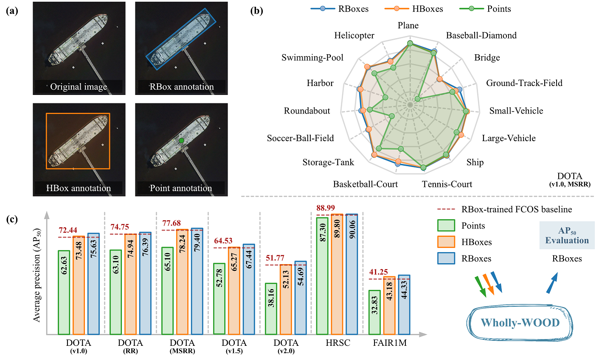

# Wholly-WOOD

> [Wholly-WOOD: Wholly Leveraging Diversified-quality Labels for Weakly-supervised Oriented Object Detection](https://arxiv.org/pdf/2502.09471)

<!-- [ALGORITHM] -->

## Abstract

<div align=center>

</div>

Accurately estimating the orientation of visual objects with compact rotated bounding boxes (RBoxes) has become an increasing demand across applications, which yet challenges existing object detection paradigms that only use horizontal bounding boxes (HBoxes). To equip the detectors with orientation awareness, supervised regression/classification modules are introduced at the high cost of rotation annotation. Meanwhile, some existing datasets with oriented objects are already annotated with horizontal boxes. It becomes attractive yet remains open for how to effectively utilize only horizontal annotations to train an oriented object detector (OOD). We develop Wholly-WOOD, a weakly-supervised OOD framework, capable of wholly leveraging various labeling forms (Points, HBoxes, RBoxes, and their combination) in a unified fashion. By only using HBox for training, our Wholly-WOOD achieves performance very close to that of the RBox-trained counterpart on remote sensing and other areas, which significantly reduces the tedious efforts on labor-intensive annotation for oriented objects.

## Evaluation on DOTA-v1.0

All the commands assume that you are currently in the whollywood folder.
```shell
cd whollywood
```

### Data preparation

Step 1. Follow the instruction of MMRotate to prepare split_ss_dota. 

Step 2. If you already have split_ss_dota on your disk, create a link:
```shell
ln -s path/to/split_ss_dota data
```

### Two-stage training

```shell
# Step 1. Train (1st stage)
# There are two options, P2H (faster) or P2R (more accurate and end-to-end capability)
python tools/train.py configs/whollywood/whollywood-1x-dota-p2h-pseudo.py
python tools/train.py configs/whollywood/whollywood-1x-dota-p2r-pseudo.py

# Step 2. Test (1st stage) to generate pseudo labels
# Points are converted to HBoxes/RBoxes and saved at data/split_ss_dota/whollywood_pseudo_labels.json
python tools/test.py configs/whollywood/whollywood-1x-dota-p2r-pseudo.py work_dirs/whollywood-1x-dota-p2r-pseudo/epoch_12.pth

# Step 3. Train (2nd stage)
python tools/train.py configs/whollywood/whollywood-1x-dota-using-pseudo.py

# Step 4. Test (2nd stage)
python tools/test.py configs/whollywood/whollywood-1x-dota-using-pseudo.py work_dirs/whollywood-1x-dota-using-pseudo/epoch_12.pth

# Step 5. Now you can upload work_dirs/dota/Task1/Task1.zip to the DOTA-v1.0 server to evaluate the accuracy
# If you choose P2H/P2R in the 1st stage, the expected accuracy is about 60%/63%
```

### End-to-end training

```shell
# Step 1. Run P2R (the same as the first step of two-stage training)
python tools/train.py configs/whollywood/whollywood-1x-dota-p2r-pseudo.py

# Step 2. Modify Line 6 of the config file to
e2e_test_mode = True

# Step 3. Test
python tools/test.py configs/whollywood/whollywood-1x-dota-p2r-pseudo.py work_dirs/whollywood-1x-dota-p2r-pseudo/epoch_12.pth

# Step 4. Now you can upload work_dirs/dota/Task1/Task1.zip to the DOTA-v1.0 server to evaluate the accuracy
# In the end-to-end mode, the expected accuracy is about 51%
```

### Proportions of Point/HBox/RBox

```shell
# The default proportion of all config files is 100% Points
# The DOTA dataset is originally annotated with RBoxes
# They can be converted to Points/HBoxes in the train_pipeline to simulate the weakly-supervised setting

# To use other proportions (e.g. in whollywood-1x-dota-p2r-pseudo.py)
# Step 1. Modify both train_pipeline and test_pipeline
dict(type='ConvertWeakSupervision',
        point_proportion=1.0,
        hbox_proportion=0.0,
        modify_labels=True),
# The "modify_labels" option modify labels to (cls_id, ws_id) format. ws_id: 0=RBox, 1=HBox, 2=Point

# Step 2. Modify Line 60 of the config file
post_process={1: 0.85, 2: 0.5}  # If 100% Points
post_process={1: 0.85}  # Otherwise

# Step 3. Run two-stage/end-to-end training
```

## Evaluation on HRSC

```shell
# End-to-end training is sufficient for HRSC
# Simply run the following command
python tools/train.py configs/whollywood/whollywood-6x-hrsc.py
```

## Results and configs

### DOTA1.0

|         Backbone         |      WS       | AP50  | lr schd |  Aug  | Batch Size |                                                                                  Configs                                                                                   |
| :----------------------: | :-----------: | :---: | :-----: | :---: | :--------: | :------------------------------------------------------------------------------------------------------------------------------------------------------------------------: |
| ResNet50 (1024,1024,200) | Point-to-RBox | 62.63 |   1x    |   -   |     2      |             [whollywood-1x-dota-p2r-pseudo](./whollywood-1x-dota-p2r-pseudo.py)<br>[whollywood-1x-dota-using-pseudo](./whollywood-1x-dota-using-pseudo.py)             |
| ResNet50 (1024,1024,200) | Point-to-RBox | 65.10 |   1x    | MS+RR |     2      | [whollywood-ms_rr-1x-dota-p2r-pseudo](./whollywood-ms_rr-1x-dota-p2r-pseudo.py)<br>[whollywood-ms_rr-1x-dota-using-pseudo](./whollywood-ms_rr-1x-dota-using-pseudo.py) |

## Citation
```
@article{yu2025whollywood,
  title={Wholly-WOOD: Wholly Leveraging Diversified-quality Labels for Weakly-supervised Oriented Object Detection}, 
  author={Yi Yu and Xue Yang and Yansheng Li and Zhenjun Han and Feipeng Da and Junchi Yan},
  year={2025},
  journal={IEEE Transactions on Pattern Analysis and Machine Intelligence},
}
```
